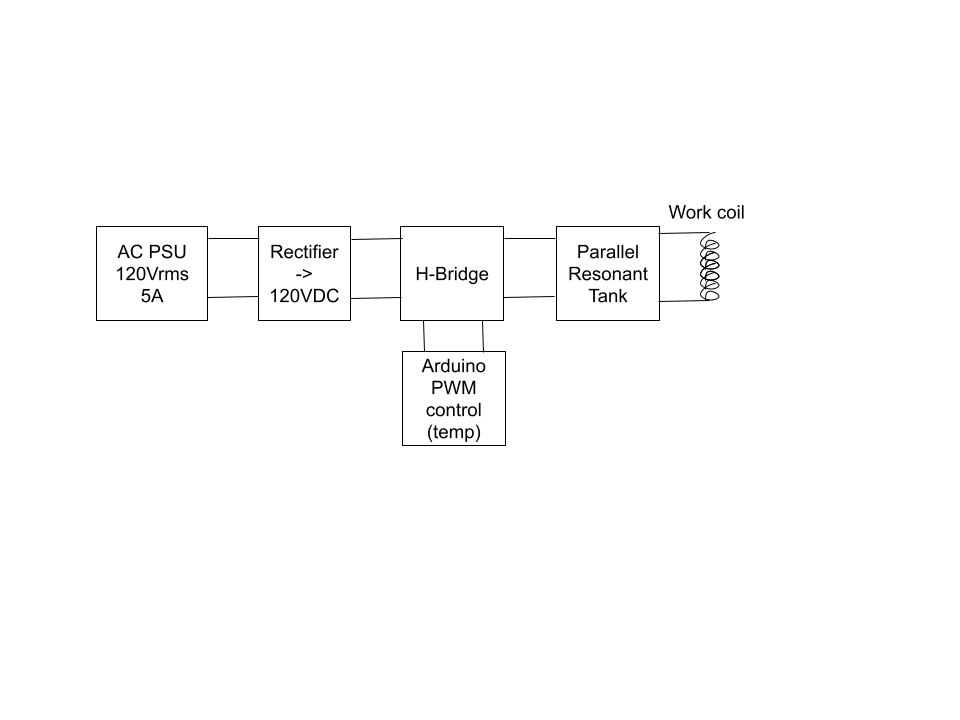
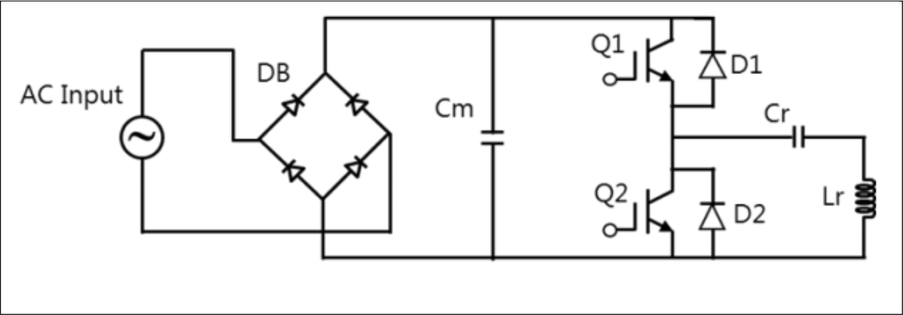

# Induction Hot Plate Proposal
Final Project for ECE448 - Power Electronics.

Fred Kim, James Ryan. Prof. Cavallaro. Spring 2026.

# Background

## Introduction

In an induction stovetop, our main goal is to induce heat dissipation into a
piece of cookware, such as a cast-iron pan. This heat is generated by shoving a
large alternating current into a *work coil*: the large current induces a
magnetic field around the coil, which in turn, induces eddy currents in our
target cookware.[^1] 

Essentially, the induced eddy currents will generate $I^2 R$ loss in the target
cookware, which is where our heat comes from. The coil itself will not get warm
beyond the heat generated from the current going through the coil.[^1]

## Technical details

IGBTs combine MOSFETs and BJTs, and are capable of switching at 10s-100s of KHz
while supporting high-current workloads, which make it suitable for this. [^1]

Our heat-generating mechanism are the eddy currents being induced in the target 
cookware. We can control the current magnitude of the eddies by directly 
changing the B-field's intensity. So, changing the current in the work 
essentially alters the induced temperature in our target cookware.

# Proposed Solution

* AC input with passive rectification stage
    * We have AC power supplies in the lab we can use
* Half-bridge Inverter
* Parallel Resonant Tank tank
    * Found high-power inductor (27uF) and capacitor (5mF) in the lab, letting
        us target a rough resonant frequency of 433Hz. This is subject to
        change, based on our second L's inductance (the Work Coil)
    * We can shift this frequency depending on the inductance of the work coil,
        and the capacitance we decide to implement. We have a lot of
        flexibility, and can potentially shift to an LC topology similar to the
        Toshiba paper[^1].
* Work Coil
    * James wanted to model and build a coil, since its kind of impossible to
        spec out parts otherwise. We would need to know the coil's inductance at
        open air, and at load (e.g. prescense of cast-iron pan). We're having
        faith the work coil we ordered is work-able.

# References

[^1]: [Toshiba Semiconductor, “Delivering Highly Efficient Induction Heating Cooking Appliances Using IGBTs.” Available: https://toshiba.semicon-storage.com/content/dam/toshiba-ss-v3/master/en/semiconductor/design-development/innovationcentre/whitepapers/TCM0542_GT20N135SRA.pdf](https://toshiba.semicon-storage.com/content/dam/toshiba-ss-v3/master/en/semiconductor/design-development/innovationcentre/whitepapers/TCM0542_GT20N135SRA.pdf)

# Additional Reading

These sources were not explicitly cited in the creation of the background or
introduction. We primarily modeled our circuit from the Toshiba whitepaper.

[Tutorial for a bolt heater](https://inductionheatertutorial.com/)

[Induction Coil Design considerations](https://www.mdpi.com/2076-3417/14/17/7996)

[Litz wire](https://ieeexplore.ieee.org/document/8340533)

[Paper on power loss reduction in a SEPR circuit](https://www.temjournal.com/documents/vol3no3/Study%20of%20Power%20Loss%20Reduction%20in%20SEPR%20Converters%20for%20Induction%20Heating%20through%20Implementation%20of%20SiC%20Based%20Semiconductor%20Switches.pdf)

Go to figure 2: Cm is PF correction, Lr and Cr. This is a SEPR circuit
(single ended parallel resonance converter)

[Coil HOW-TO](https://www.instructables.com/DIY-Induction-Heater-Circuit-With-Flat-Spiral-Coil/)

[ZVS Whitepaper](https://www.ti.com/lit/ml/slup089/slup089.pdf)
