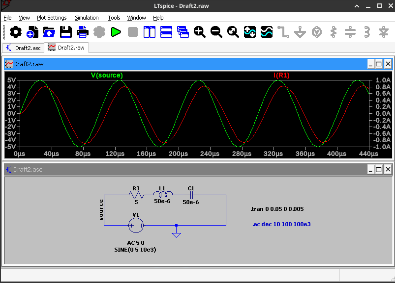
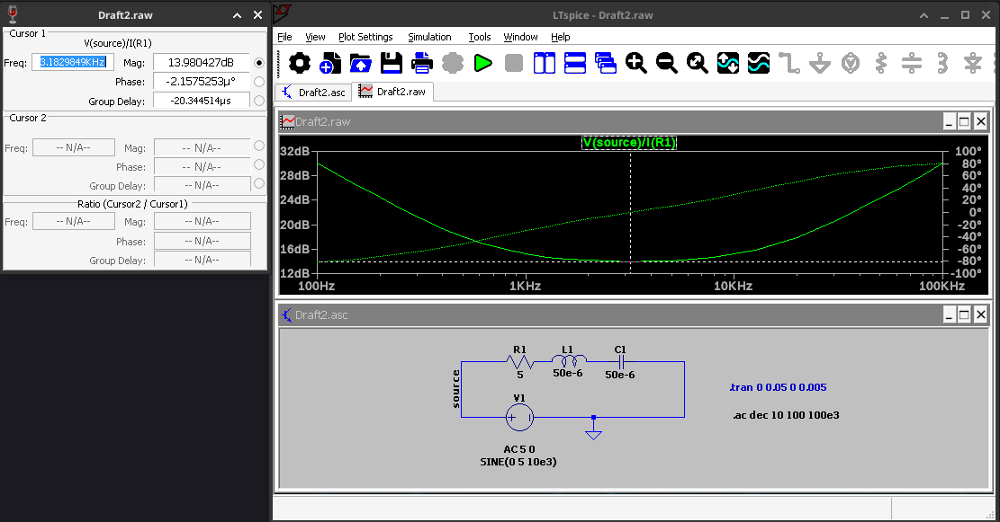
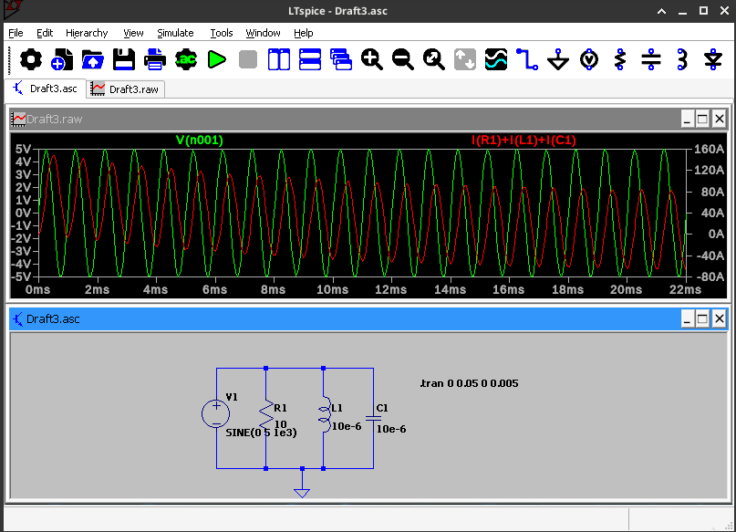
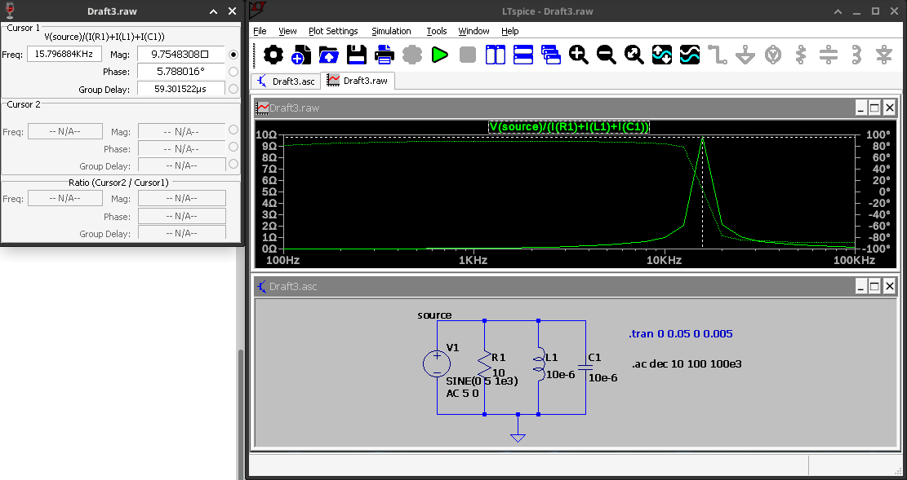

# Simulation 1
James Ryan, ECE448, Spring 2026

# question 1

## a

### i

### ii

Voltage leads current.

### iii

Capacitave.

## b 

### i

Note that the left-hand vertical axis describes the magnitude of the impedance in ohms
and the right-hand vertical axis describes the phase of the impedance.

Also note that I *do not* have the fonts installed to render ohms correctly in
the cursor menu (it shows up as an empty square, instead).

### ii 

5 ohms. 

This intuitively makes sense because we are operating at our resonant frequency
at this point. Resonance is the point where the magnitude of the capacitor's
reactance is equal to the magnitude of our inductors reactance. The two
components end up cancelling each other out, acting as a short.

### iii 

A phase difference of 0 degrees makes sense because it indicates that our load
is purely resistive and not reactive. Thinking in phasors, if we don't have any
reactive components, our inductance will not have a phase offset. 

### iv

It is in the 2nd / 4th quadrant (capacitave).

Generally, our inductor operates as a *short* at DC, and an *open*
at infinite frequency. The capacitor is the opposite, acting as an *open* at low
frequencies and a *short* at high frequencies.

So, when we operate to the lefthand side, we are dropping our frequency, and as
a result the reactance of our capacitor is greater than the inductor's
reactance.

# question 2

## a

### i

### ii

Voltage leads current

### iii 

Capacitive

## b

### i

Note that the left-hand vertical axis describes the magnitude of the impedance in ohms
and the right-hand vertical axis describes the phase of the impedance.

### ii

10 ohms.

This makes sense for a similar reason to the series case. Note that susceptance
is the inverse of reactance. In those terms, at our resonant frequency, our
susceptances end up being equal in magnitude, and will cancel each other out,
creating net zero current across them.

### iii

The 0 degree phase at the peak makes sense, since it confirms to us that our
impedance is completely resistive and not reactive, and as a result, we are not
drawing any net current through our tank.

### iv

1st / 3rd quadrand (inductive). The logic from q1, part b.iv applies if we think 
in terms of susceptance: at low frequencies, inductors have infinite susceptance,
capacitors have zero susceptance, and at high frequencies, inductors have zero
susceptance and capacitors have infinite susceptance.

So, operating at low frequency, our susceptance for an inductor is greater than a
capacitor's, therefore we are inductive.

# feedback

This took me ~2 hours to finish, requiring me to go back and review previous
materials.

This was a balanced homework, the questions didn't have super obvious answers,
and it was a nice warm up to the semester.

I felt a little unclear on what's acceptable for intuitive, and i went between a
couple answers. Ultimately i wrote what is most intuitive to me, which are the
reactive / susceptive relationships.
