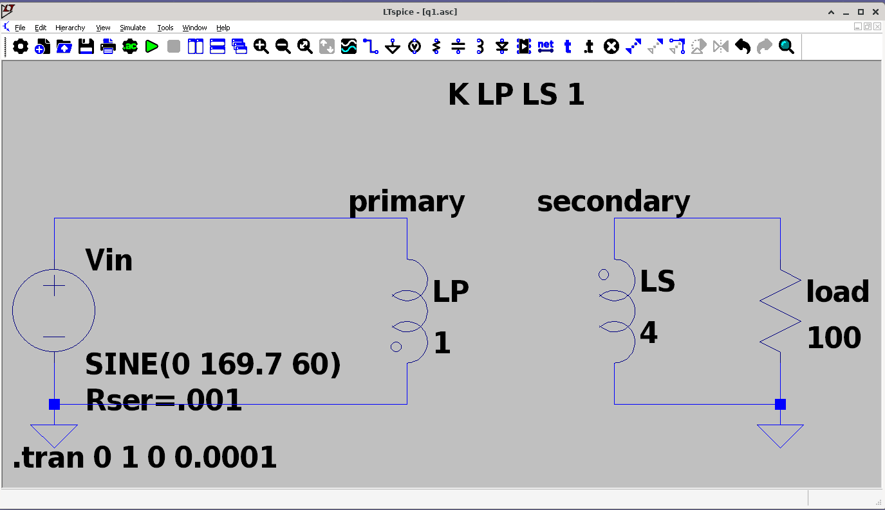
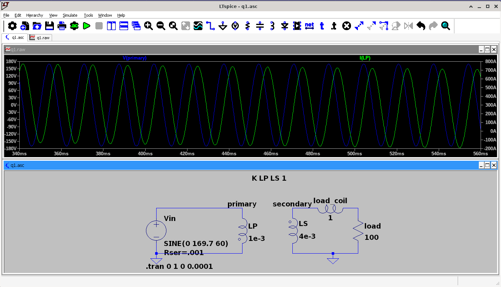
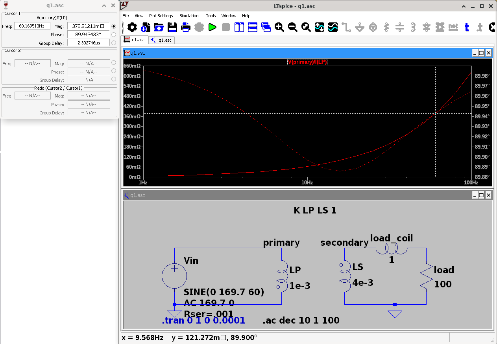
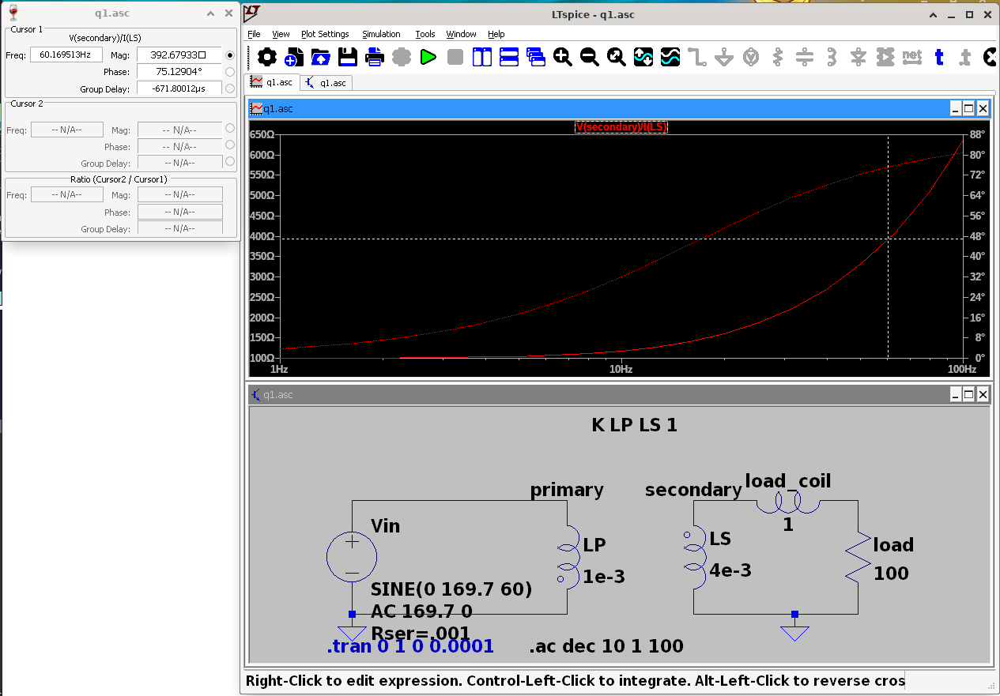
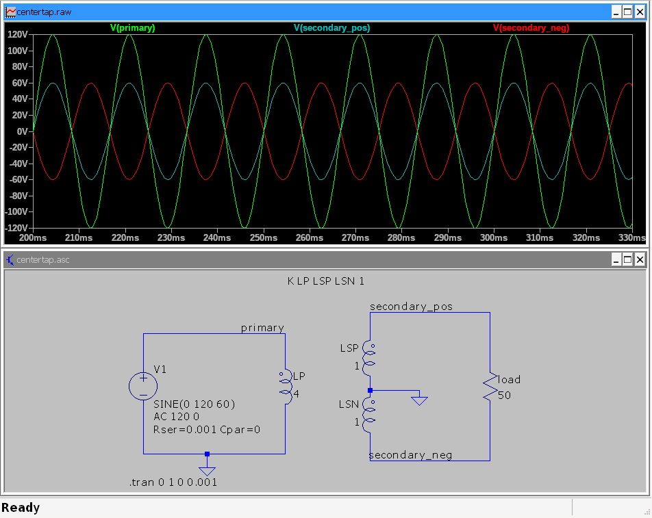
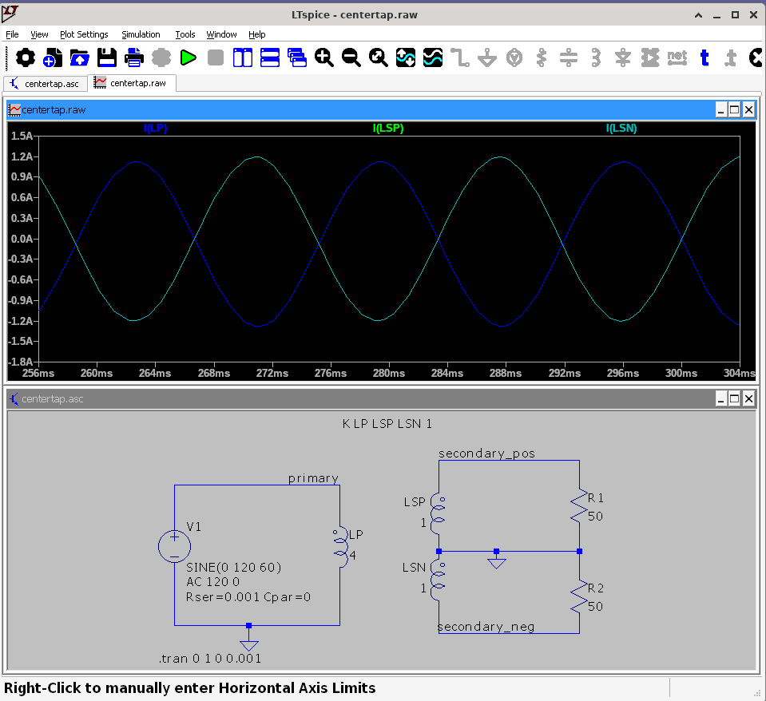
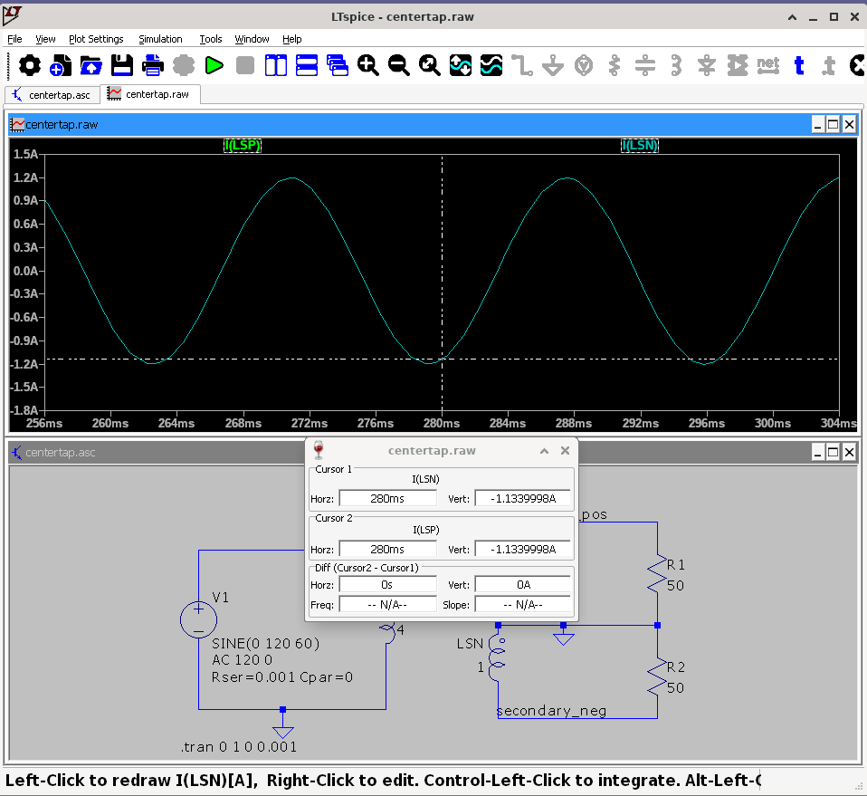
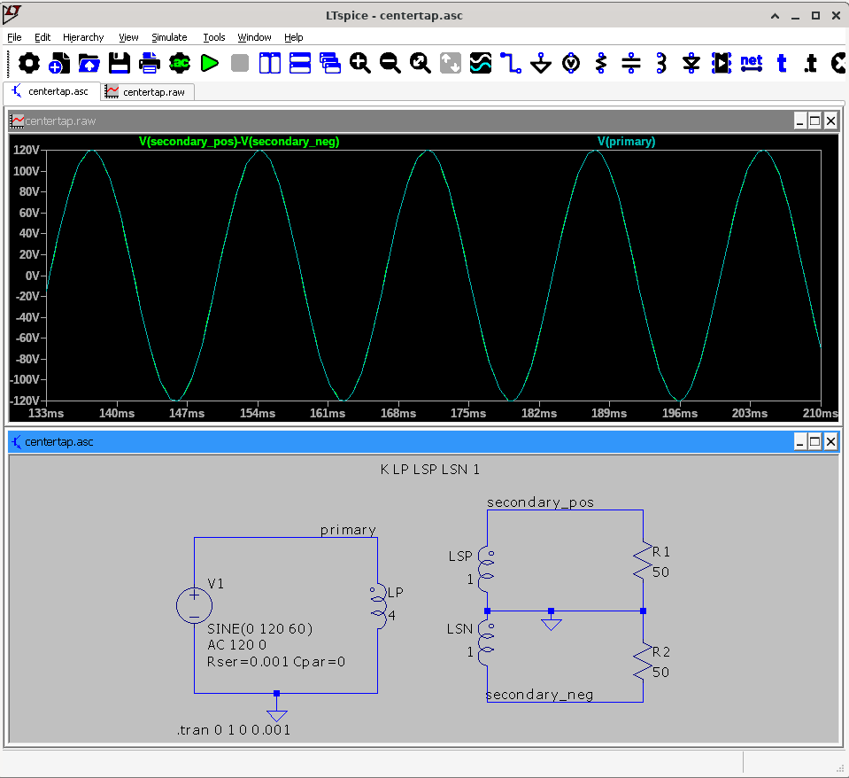
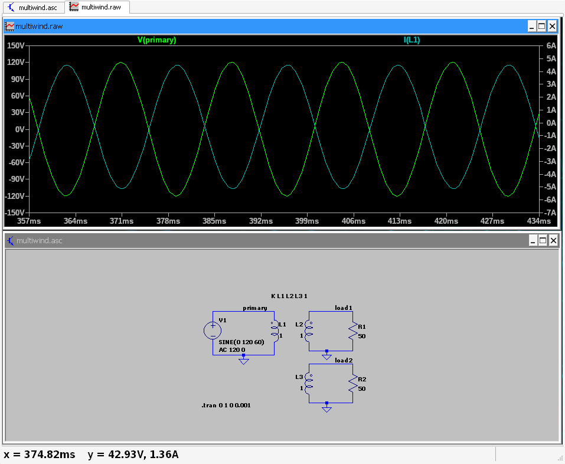
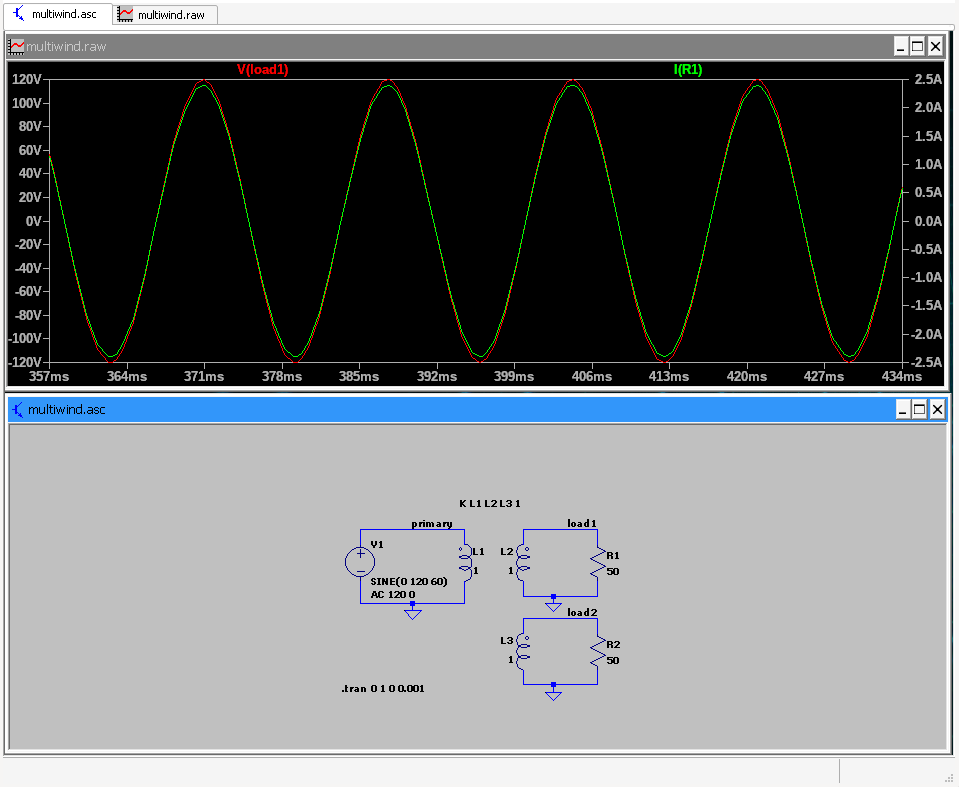

# Simulation 2

James Ryan, ECE448

# q1

## a

## b

## c

*While maintaining the turn ratio between the primary and secondary coils*,
I found that advancing the primary coil to `1e-6` henries caused the current
in the secondary coil to top out at a peak amplitude of `1.20` amperes.

The primary coil's current approaches infinity as we drag the inductance down
because the impedance of an inductor is governed by $j \omega H$. Given that our
$\omega$ is a constant `60` Hz, we can say that by dropping our $H$ we are
dropping the series impedance, allowing more current to flow from the power
source.

It should be noted that our secondary coil's current is being limited by this
drop. Consider the relationship between a primary and secondary coil:
$\frac{v_p}{v_s} = \frac{i_s}{i_p}$. Our $v_p$ is constrained as a constant peak
voltage of `169` volts, and our secondary voltage $v_s$ has to obey 
$v_s = 2 v_p$ due to our inductance ratio. Therefore, in the relationship
between current and voltage between the primary and secondary coils, we have to
obey $i_s = \frac{v_p}{v_s} i_p = \frac{1}{2} i_p$, so our $i_s$ will decrease
to maintain the enforced ratio. 

## d

Voltage leads current. So, power factor is lagging.

## e

## f

I see a magnitude far less than what I calculated, about `370` mOhms at `60` 
Hz. 

I see the correct load impedance on the secondary side. Treating `LS` as a
source, I expect to see `mag(100+j120pi)` $\approx$ `390` Ohms on the other
side, which is there.

I believe that FUCK THIS

## g

I would want to change the `K` directive, namely i'd drop `1` to a value lower
than `1` and at least `0`. 

According to the [LTspice Docs](https://www.analog.com/en/resources/technical-articles/ltspice-basic-steps-for-simulating-transformers.html)
 the `K` directive models the mutual inductance between two inductor
 objects, so setting this to a value less than `1` would indicate a flux
 leakage not contributing to the power transfer.

# q2

## Center-tap transformer

## Balun Transformer

### Differential mode

This uses a differential input, with $V_{peak} = 120$ V, running at $60$ Hz.

Note that the summed 240 V output (purple) is in phase with one end of the 120 V
differential input (green - in phase; blue - out of phase).

### Common mode

This uses a common mode input, where both `comm_in` nets are running in phase
with each other.

Note that the `upper` waveform is running at $V_{peak} = 120$ V, and the `lower`
waveform is running at $V_{peak} = 30$ V. We expect to see the result at the
other end to be $90$ V at peak.

## Multi-winding transformer

This is configured to be an isolating transformer; the inductance ratio between
the primary coil and any of the load coils is 1:1. Therefore, there should be no
change in the magnitude of the voltage when observing on the primary or
secondary side of the coil.

Note that the voltage on the primary coil is 180 degrees out of phase with the
current through the coil, however, the load / secondary coil's voltage waveform
is in phase with its current.

We observe the isolating effects. The magnitude of the voltage waveform between
the primary coil and either load is the same, however, the primary current is
split evenly between the two loads (since R1 is equal to R2). 

We observe at 60Hz that our power is conserved, the power at the primary side is
transferred equally to our two equal loads.
