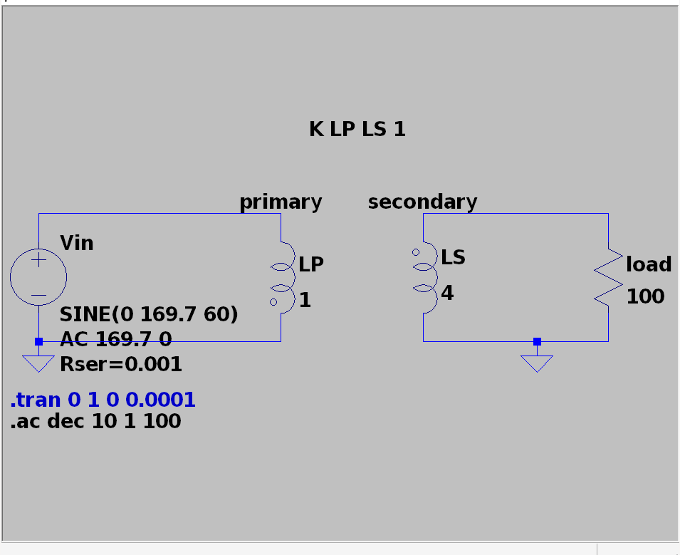
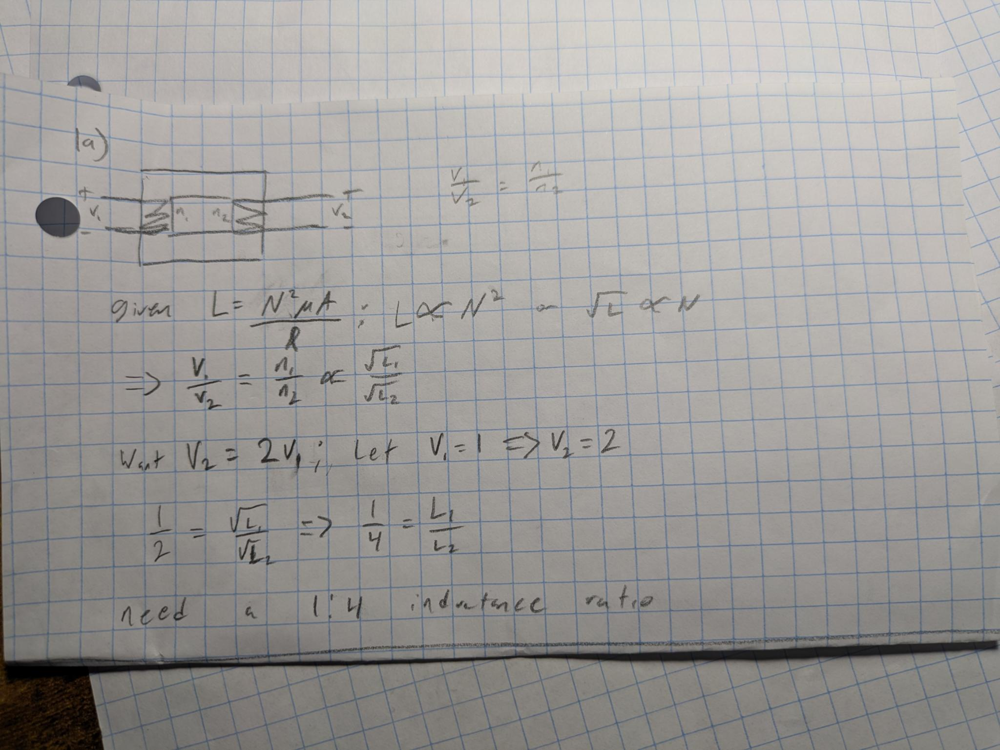
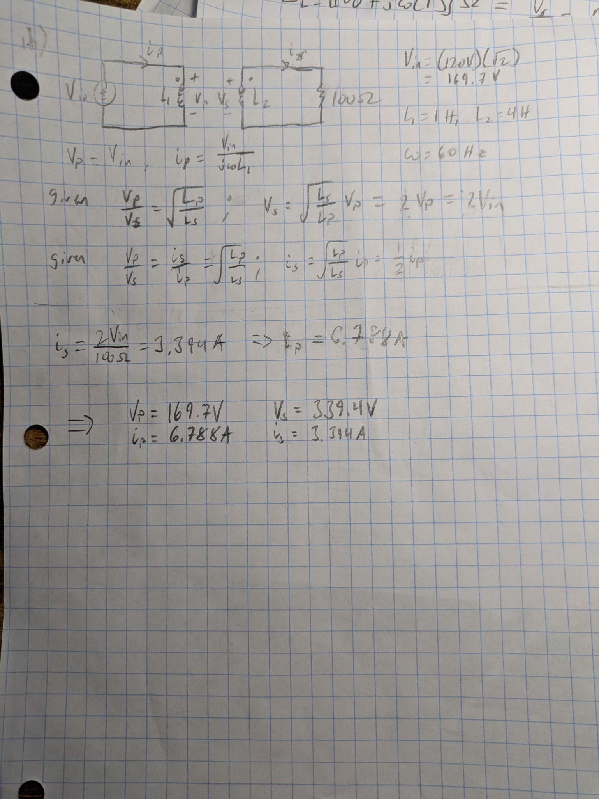
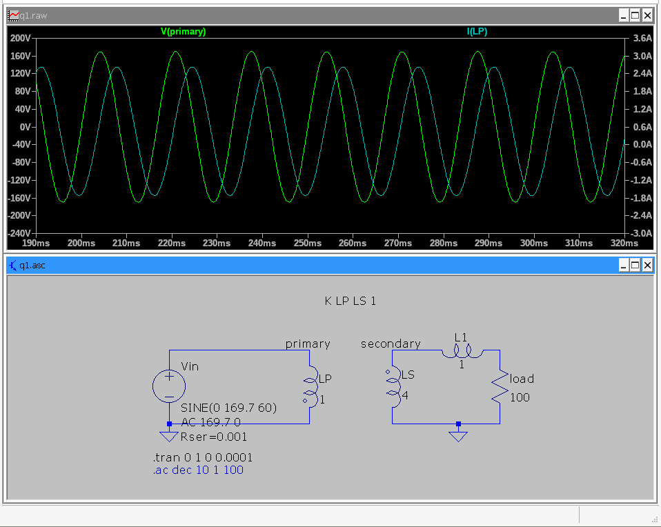
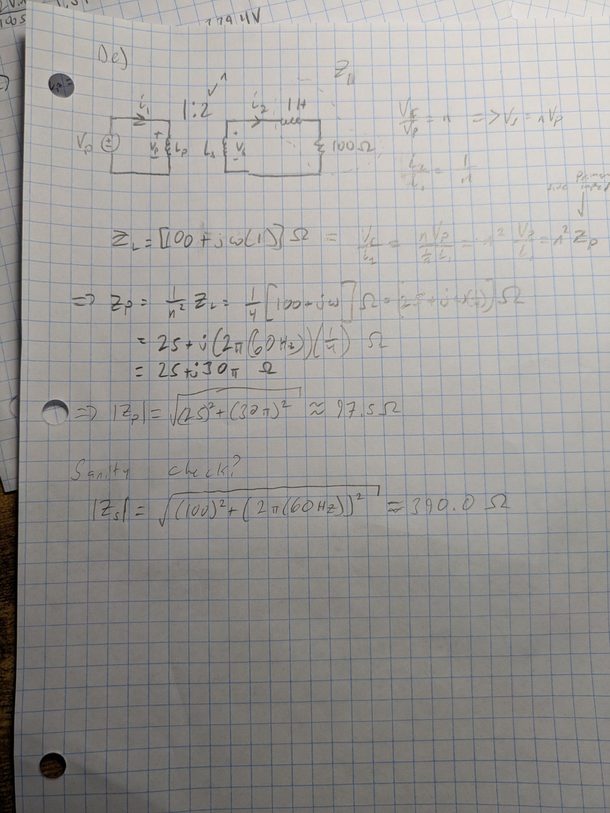
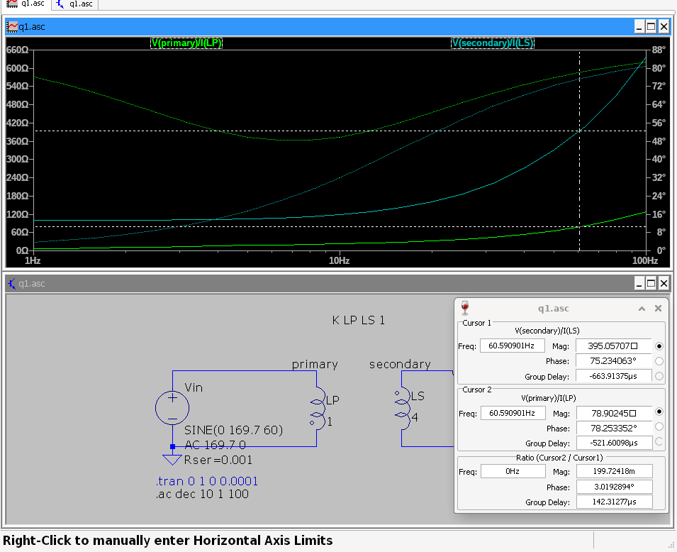
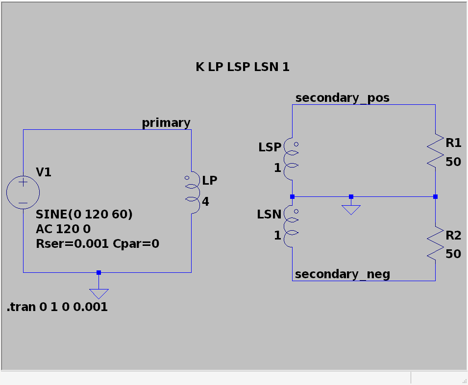
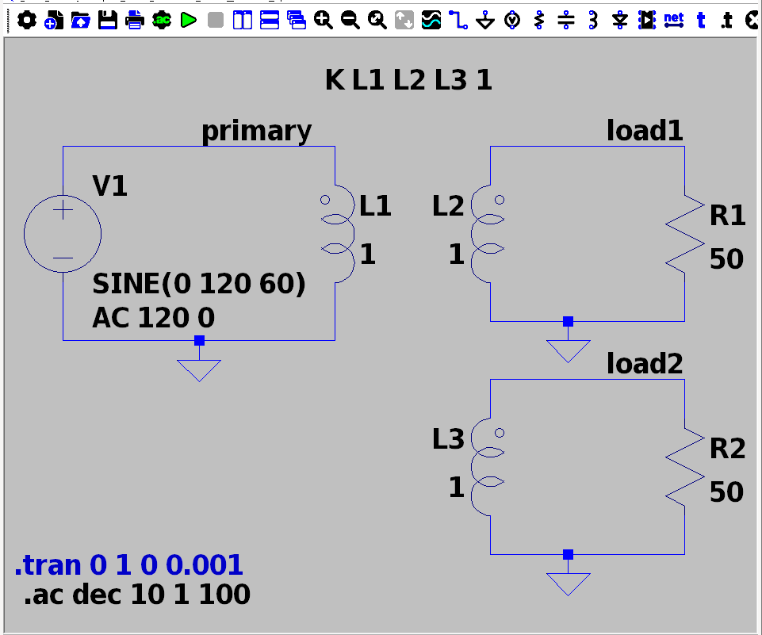

# Simulation 2

James Ryan, ECE448 Power Electronics, Spring 2026

# q1

## a

{width=70%}

## b

{width=70%}

## c

*While maintaining the turn ratio between the primary and secondary coils*,
I found that advancing the primary coil to `1e-6` henries caused the current
in the secondary coil to top out at a peak amplitude of `1.20` amperes.

Stepping back a decade gave a result closer to what was calculated at the
previous part.

The primary coil's current approaches infinity as we drag the inductance down
because the impedance of an inductor is governed by $j \omega H$. Given that our
$\omega$ is a constant `60` Hz, we can say that by dropping our $H$ we are
dropping the series impedance, allowing more current to flow from the power
source.

It should be noted that our secondary coil's current is being limited by this
drop. Consider the relationship between a primary and secondary coil:
$\frac{v_p}{v_s} = \frac{i_s}{i_p}$. Our $v_p$ is constrained as a constant peak
voltage of `169` volts, and our secondary voltage $v_s$ has to obey 
$v_s = 2 v_p$ due to our inductance ratio. Therefore, in the relationship
between current and voltage between the primary and secondary coils, we have to
obey $i_s = \frac{v_p}{v_s} i_p = \frac{1}{2} i_p$, so our $i_s$ will decrease
to maintain the enforced ratio.

*Note:* I'll revert the inductors to $L_{p} = 1$H and $L_{s} = 4$H for the
remainder of the problem, since it provides the calculated current balance we
expect to see (where $I_p \approx 6.8$A and $I_s \approx 3.4$A). I spent more
time than I should have trying to make the `1e-3` value work.

## d

Voltage leads current. So, power factor is lagging.

## e

{width=70%}

## f

At $f=60$ Hz, we can see that the primary side sees approximately $78\Omega$.
This is less than what we calculated; we expected to see approximately
$98\Omega$.

As a sanity check...

I see the correct load impedance on the secondary side. Treating `LS` as a
source, I expect to see `mag(100+j120pi)` $\approx 390\Omega$ on the other
side, which is there (see the blue trace, cursor 1).

## g

I would want to change the `K` directive, namely i'd drop `1` to a value lower
than `1` and at least `0`. 

According to the [LTspice Docs](https://www.analog.com/en/resources/technical-articles/ltspice-basic-steps-for-simulating-transformers.html)
 the `K` directive models the mutual inductance between two inductor
 objects, so setting this to a value less than `1` would indicate a flux
 leakage not contributing to the power transfer.

# q2

## Center-tap transformer

*Note:* I assume by setting the correct dot convention, we should follow what
you have on the slides for this question. This does make sense to me, since it
works out that the top node is in-phase, and the bottom node is out-of-phase for
this.

The primary purpose of a center tap transformer is to tap the center of the
transformer to a fixed reference voltage. In this case, we are fixing it to
ground. So, we can produce two differential waveforms from a fixed reference
wave. 

In our case, the primary and secondary (tapped) inductor have an equal number of
windings, but our secondary is fixing our voltage at the center to ground. This
effectively creates two differential waves, each at half the $V_{peak}$ of our
primary input.

The easiest way to explain this is thinking of the isolating transformer. For an
isolating transformer, the voltage difference seen at the primary should be
equal to the voltage difference seen at the secondary. Introducing the center
tap enforces the center of the transformer to be at ground, creating two
transformers with half the windings relative to the primary. Therefore, our
"positive" side will rise in phase with the primary. However, we have the
"negative" side below the ground reference, which is also half the windings.
***The voltage difference between the primary coil and the tapped secondary must
be equal***. So, our negative side is pulled down, creating a differential, 180
degree out of phase waveform, also at half peak relative to the primary.

From this plot, it can be said:

The **current** waveform on the primary side is *out of phase* with the
    secondary side's current. The coils on the secondary side, expectedly, have
    their current waveforms in phase, because they're wired in series. This is
    expected, thinking of Lenz's law and Faraday's Law: the direction of the 
    induced EMF will oppose the direction of the change in flux. So, the
    direction of our current in the primary coil opposes the direction of the
    current in the secondary coil, too. (*Aside:* We'll see this pattern appear 
    again in future transformers.)

The **voltage** waveform on the secondary's positive side is *in phase* with the primary,
    and the **voltage** waveform on the secondary's negative side is *180
    degrees out of phase* with the primary. Expected from the center tap!

## Balun Transformer

The Balun (*Bal*anced-*Un*balanced) transformer is configured to have one
balanced side, where neither terminal is grounded, and one unbalanced side,
where one terminal is held to ground.

Similarly to the center-tapped transformer, the total voltage drop across the
primary side should be equal to the voltage drop across the secondary side (NOT
considering turn ratio). 

### Differential mode

This uses a differential input, with $V_{peak} = 120$ V, running at $60$ Hz.

We expect to see our output waveform scale to $2V_{peak}$. In this differential
setup, the largest drop across the primary coil will be from $+120$ V to $-120$
V. Since the secondary side has one net held to ground, our other net will be
induced to maintain this drop, and will be pulled to $240$ V, and will be
in-phase with the signal attached to the phase-dot terminal.

We can see (especially in the AC results) that there is a slight voltage lag in
the `pos` input, and likewise a slight voltage lead in the `neg` input.

The current on the sum-side is 180-degrees out of phase with the current on the
double-ended side. This is expected, considering Lenz's law and Faraday's law.

The summed $240$ V result is in-phase with the `pos` differential input. This
intuitively makes sense: the induced current is out of phase with the current on
the primary side. And, our secondary load is entirely resistive. So, we expect
our voltage to be entirely in phase with the current on the secondary side.
THEREFORE! Our voltage peaks on the secondary side will track the voltage peaks
on the primary side, since our current peaks on the secondary side track the
current troughs on the secondary side, and we are guaranteed to have voltage out
of phase with current on the primary side from Lenz's law.

There is about $1$ W lost between primary and secondary, presumably due to the
slight resistance in `L1` and `L2`.

### Common mode

This uses a common mode input, where both `comm_in` nets are running in phase
with each other. They do not necessarily have the same $V_{peak}$

Note that `V3` and `V4` have `Rser=50`. This was done to center the current
waveforms at 0 so it's a little more clear whats happening.

We can see that, at the `upper` net we observe a peak voltage of around $90$ V,
and on the `lower` net we see $60$ V. Therefore, the total drop across the coil
should be $30$ V, which can be seen on the secondary side. 

We see (especially on the AC plot) that both common inputs experience a voltage
lag.

We see a similar trend with the voltage and current waveforms: the current on
the primary side is out of phase with the voltage on the primary side, and the
current on the secondary side is in phase with the voltage on the secondary
side. 

## Multi-winding transformer

This is configured to be an isolating transformer; the inductance ratio between
the primary coil and any of the load coils is 1:1. Therefore, there should be no
change in the magnitude of the voltage when observing on the primary or
secondary side of the coil.

Note that the voltage on the primary coil is 180 degrees out of phase with the
current through the coil, however, the load / secondary coil's voltage waveform
is in phase with its current. This is somewhat expected; considering Lenz's Law
and Faraday's law, we should see this out-of-phase current between coils due to
the emf opposing the change in flux. And, logically, the loads at the secondary
coil (`R1` and `R2`) are each sinking power from a secondary coil. And, our
primary coil is acting as a source for those secondary coils, so naturally the
power conserved: the secondary coils source the primary coil for their power
demand, so the primary coil is a negative impedance.

We observe the isolating effects. The magnitude of the voltage waveform between
the primary coil and either load is the same, however, the primary current is
split evenly between the two loads (since R1 is equal to R2). 

We observe at 60Hz that our power is conserved, the power at the primary side is
transferred without loss to our loads.

# Feedback

This entire homework took me about 12-15 hours of work over 3 days, and I
rewrote a couple of sections a couple of times. That could explain if some
section doesn't make complete sense. 

The first question was ok, but the wording was a little vague at some points.
For part C, I could not tell if i was supposed to have both sides match in
current magnitude, since there was a note about observing the primary current
rise to infinity. 

The transformers were ok. Open ended is good, leaves a lot of room to play
around (I went in circles at some points, such as figuring out whether to
consider the phase dots).
