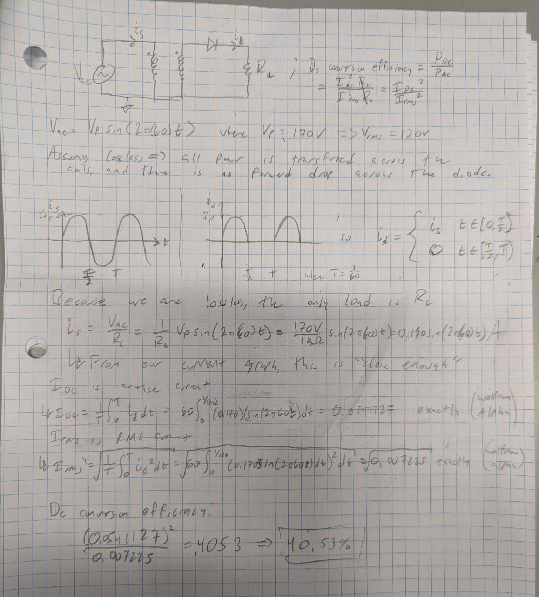
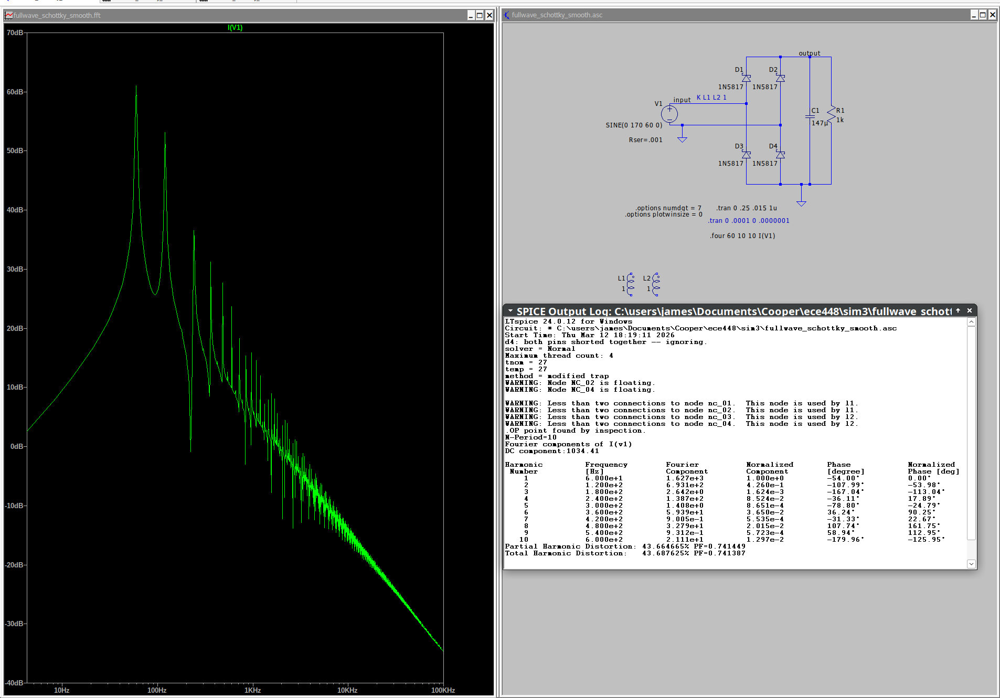

# Simulation 3

James Ryan, ECE448 Power Electronics, Spring 2026

# q1 - halfwave rectifier

$\text{Conversion Efficiency}=\frac{P_{DC}}{P_{AC}}$, where $P_{DC}=I_{dc}^2 
\cdot R_L$ and $P_{AC} = I_{rms}^2 \cdot R_L$

# q2 - fullwave rectifier

## Silicon diodes

Even though it wasn't explicitly necessary, I had some issues getting the sim
right with a non-isolated input, so I included an isolating transformer.

## Schottky diodes

The primary advantage of schottky diodes comes from their low forward voltage
and fast switch speed. Because we are at a high peak voltage and relatively low
frequency, I don't anticipate that much difference between the two.

It should be noted that Schottky diodes tend to have worse reverse blocking
capabilities than typical silicon diodes. According to the 1N5817 datasheet,
these devices can block up to 14 volts (rms). So I think these would explode in
real life.

Changing the source voltage to be a little lower, around 1V, and the
frequency to be much larger, around 100kHz, we may see some more change

For the current analysis, I got rid of the isolation transformer since it caused
weird results (e.g. every even harmonic disappeared?)

From LTSpice's log: $THD=43.687625%$

# q3 - voltage doubler

# ec
