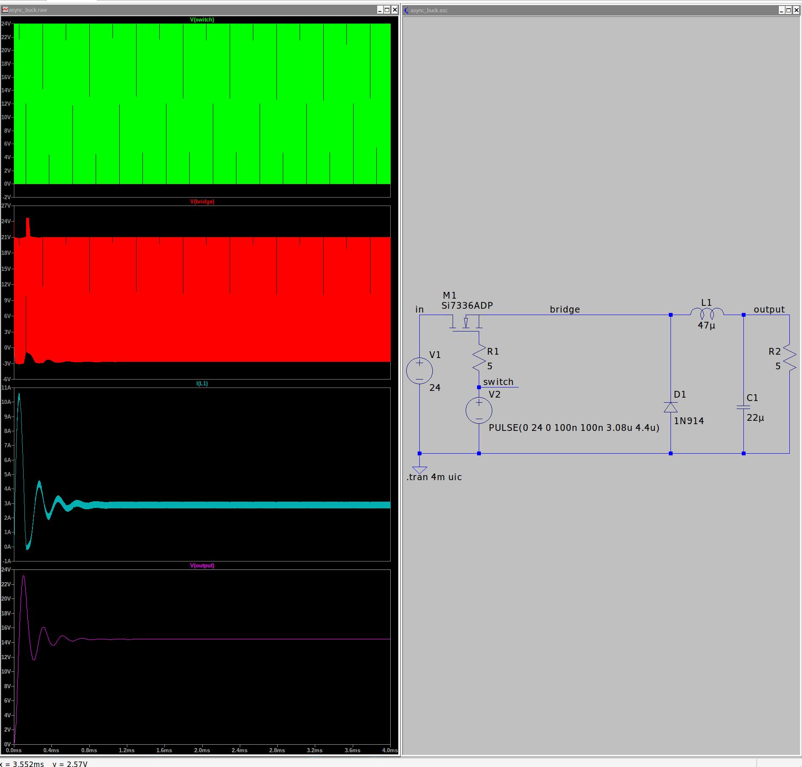
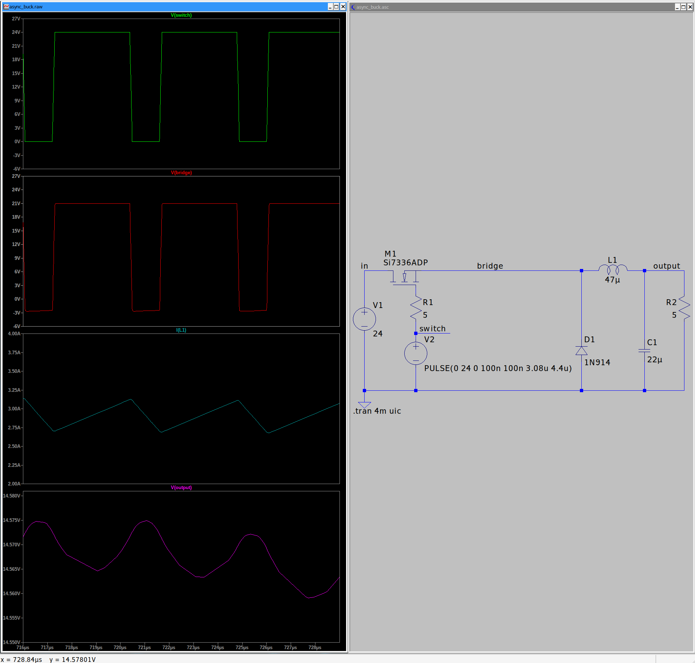
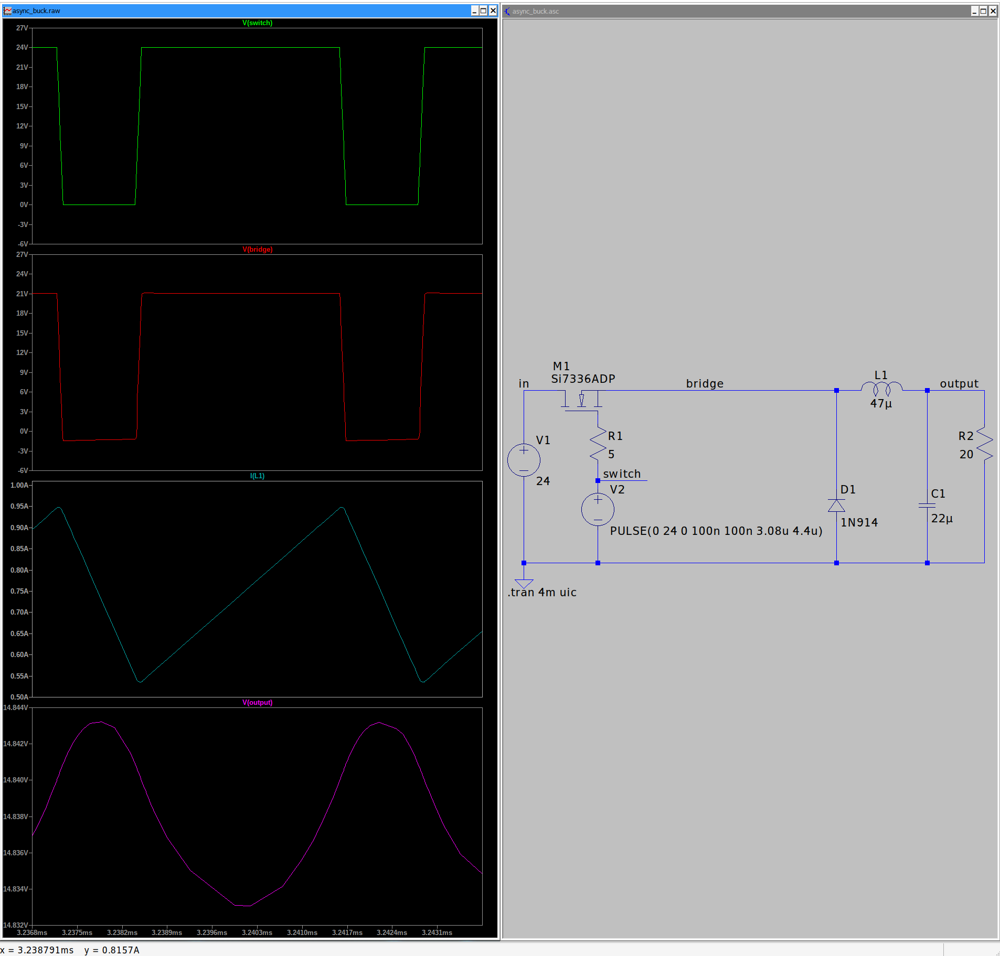
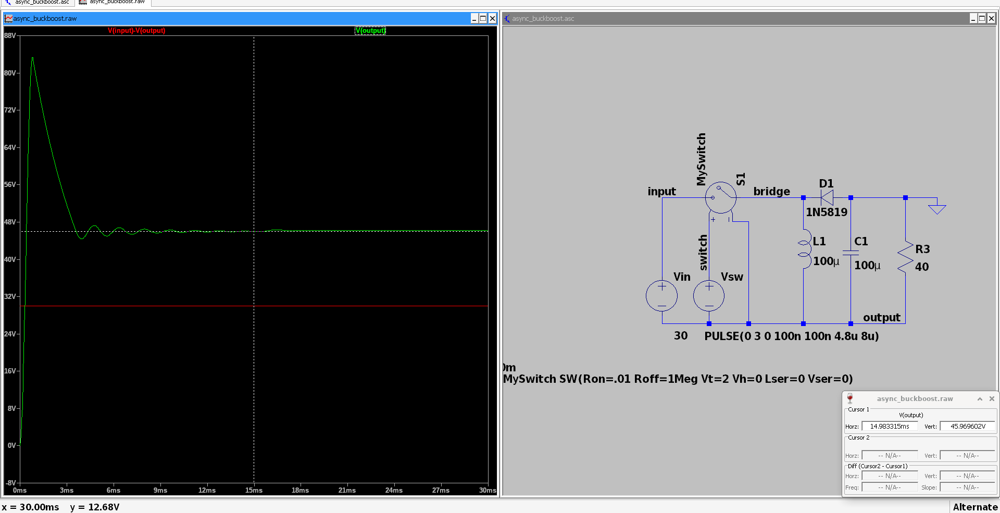
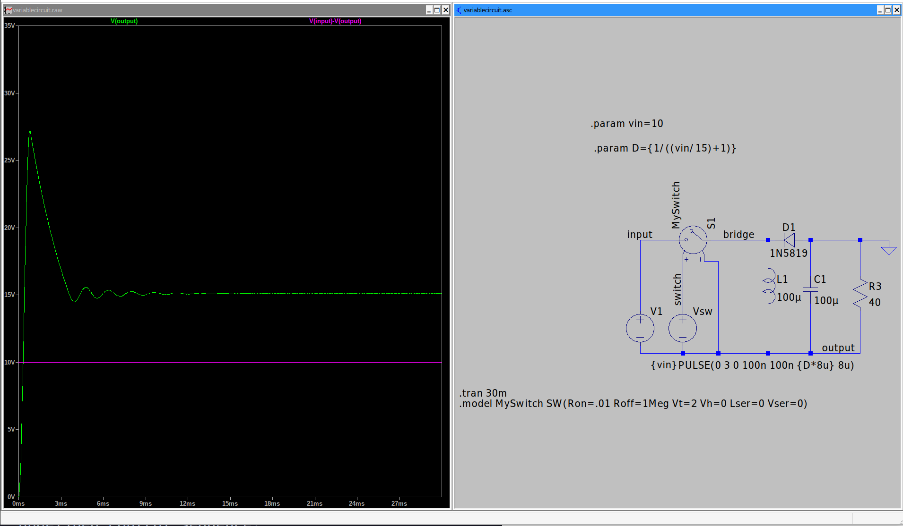
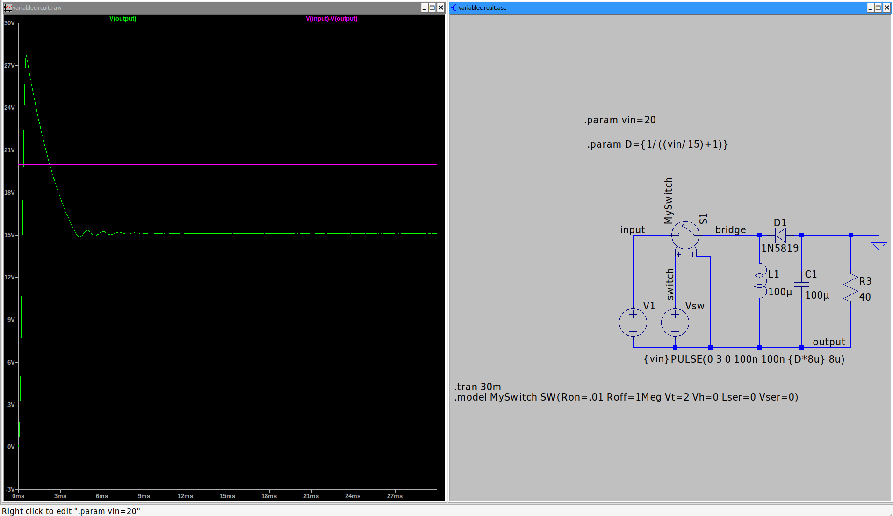

# Simulation 4

James Ryan, ECE448 Power Electronics, Spring 2026

# q1 - async buck converter

## a

$D = \frac{t_{on}}{t_{on}+t_{off}} = \frac{7}{10}$

Let $T = 4.4 \mu s$, so $t_{on} = 0.7 \cdot 4.4 \mu s = 3.08 \mu s$,
and $t_{off} = T - t_{on} = 1.32 \mu s$.

We assume our switching device has a slew rate of $100ns$, a typical rise / fall
figure for the LM555 timer.

Note that our voltage ripple maintains about a $10mV$ peak to peak swing, it's
steady enough to be considered a roughly $14.57 V$ DC output.

## b

Changing `R2`, our load resistor, from $5 \Omega$ to $20 \Omega$ caused our DC
center to raise to around $14.838 V$ at the output, and our current to drop and
be centered around $0.73 A$.

This is because the higher output resistance demands less current from the
buck converter, so the output voltage levels raise. This is seen on the switch
utilization chart, where our duty cycle primarily impacts our efficiency.
Usually, in applications where we want to keep the output voltage at a steady
level, we implement some kind of feedback to adjust $D$ as our load demands
change.

{width=40%}

# q2 - async buck boost converter

## a

$D = \frac{t_{on}}{t_{on}+t_{off}} = \frac{4}{10}$

Let $T = 8 \mu s$, so $t_{on} = 0.4 \cdot 8 \mu s = 3.2 \mu s$,
and $t_{off} = T - t_{on} = 4.8 \mu s$.

We assume our switching device has a slew rate of $100ns$, a typical rise / fall
figure for the LM555 timer.

Note the reference inversion! The bottom node, our positive output terminal, is
allowed to float and shift as the circuit reaches steady state. So, in sim, we
hold the 'top' of the resistor at a fixed ground to get an interpretable output.

## b

It's bucking, since our duty cycle, $D$ is $< 50\%$. 

At lower voltages, this is impacted by the voltage drop across the diode `D1`,
however, we can demonstrate this behavior by boosting our input DC voltage to be
significantly larger than this loss; we set $V_{in} = 30V$ and observe a
$V_{out} = 20V$.

$\frac{D}{1-D} = \frac{.4}{1-.4} = \frac{2}{3}$, so $30V \cdot \frac{2}{3} = 
20V$

In the same regard, pushing $D > 0.5$ gets us our boosting behavior. Adjusting
the duty cycle $D = 0.6$:

$\frac{.6}{1-.6} = \frac{3}{2}$, $30V \cdot \frac{3}{2} = 45V$

# q3 -- Variable buck boost

Considering our $\frac{V_{out}}{V_{in}}$ equation in terms of $D$, we can
rearrange to get an expression of $D$ considering our current input and target
output voltage.

\begin{align*}
&\frac{V_{out}}{V_{in}} = \frac{D}{1-D} \\
\Longrightarrow &\frac{V_{in}}{V_{out}} = \frac{1-D}{D}\\
&= \frac{1}{D} - 1 \\
\Longrightarrow &\frac{1}{D} = \frac{V_{in}}{V_{out}} + 1 \\
\Longrightarrow &D = \frac{1}{\frac{V_{in}}{V_{out}} + 1} \\
\end{align*}

This can be implemented in LTSpice as just a couple of parameters.

